# LeoBenChoi

> 桌面运维 | Golang 后端学习中

---

### 📂 Profile
- **Focus**: `Backend Development (Golang)`
- **Tech Stack**: Go, Python, Java, C, Shell
- **Environments**: Arch Linux, Kali, Ubuntu
- **Tools**: Vim / Docker / Git

---

### 🛠️ Skills

---

### 📊 Metrics
 

---

### 🔗 Contact
- **Blog**: [leobenchoi.com](https://leobenchoi.com)
- **Email**: 2451535770@qq.com
